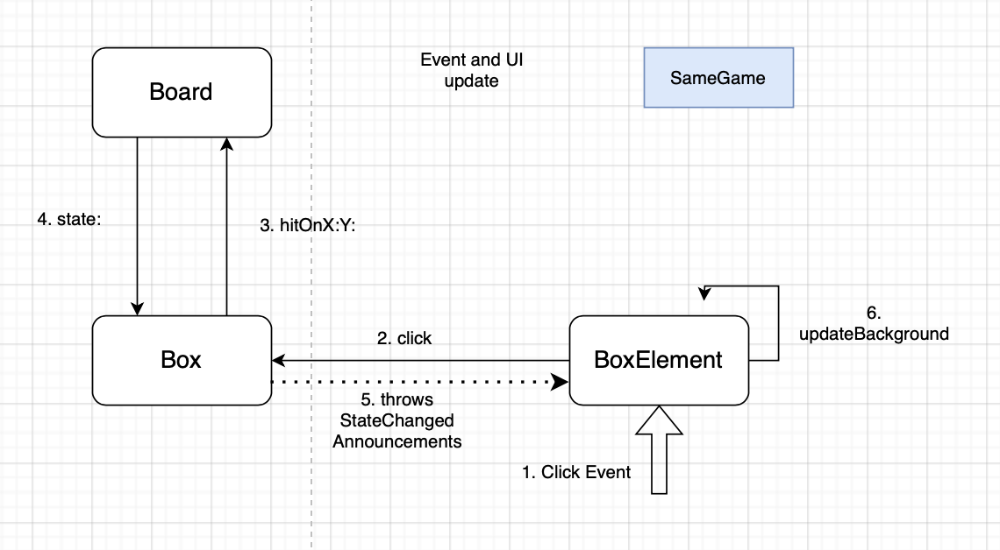

# SameGame Documentation

SameGame is a game created with Myg, the goal is to click on groups of colored cells and make them disappear to clear the board.

This document aims to explain the implementation of this project and how was designed the architecture between Model and UI using Bloc.

## Basics

This game was originally implemented by students following a course on Meta Programming. The project got corrected and upgraded to its current version. 

The model for SameGame follows the basics of Myg architecture with a `SGBoard` (inheriting `MygBoard`) containing many `SGBox` (inheriting `MygAbstractBox`).
  
The UI side of the project also follows the basic Myg architecture but this game is considered "static" as a BoxElement represents a Box and will only apply changes to this Box


Each BoxElement has an UI according to the color of the Box it represents (Red,Blue,Green,Yellow,Gray). 

A first implementation had different subclasses of `SGBox`, one for each color, so that each subclass overrides the `backgroundRepresentation` method that returns the color to draw. But as Boxes move across the board, this implied re-assign a new Box to BoxElements and it complicated the code.
We counter this problem using a Strategy Pattern where there is only one class `SGBox` and each instance has a State that can be one instance of the multiples State classes, each representing a color. This leads to Boxes staying at the same place in the board and only switching their states, and we don't have to reassign new Boxes to our BoxElements.

Each BoxElement now draws itself according to the State of the Box it represents.

Moreover, as our different States only exists for their `backgroundRepresentation` method, we can make them singletons and avoid creating a State object for each Box.

```st
SGBox >> #backgroundRepresentation

	^ self state backgroundRepresentation
```
```st
SGBlueState >> #backgroundRepresentation

	^ Color lightBlue
```

Now, to update the UI we choose to make a BoxElement change its background whenever its box change its state. That is why we decide to use Announcements.

We develop the concept of Announcements in the following chapter

## Annoucements 

Announcements are objects that represent the concept of an object listening to another. An object "Listener" can subsribe to an Announcer that is held by an object "Speaker". During execution, the Speaker can announce some Announcements, making the Listener react depending each Announcement. This is the architecture used here.

We define in our Boxes an attribute 'announcer' (here lazily initialized) and we make our BoxElement subscribe to the announcer like such:

```st
SGBoxElement >> #initializeAnnouncements

	self box announcer
	when: SGStateChangedAnnouncement
	send: #updateBackgroundColor
	to: self
```

It means that whenever the Box announcer throws the SGStateChangedAnnouncement, the BoxElement will receive the message 'updateBackgroundColor' which looks for the background needed into its Box.

```st
SGBox >> #state: aState

	state = aState ifTrue: [ ^ self ].
	state := aState.
	self announcer announce: SGStateChangedAnnouncement new
```

```st
SGBoxElement >> #updateBackgroundColor

	self background: self box backgroundRepresentation
```

The main loop of events is very basic for this game. When clicking on a Box, the Board reacts and do whatever is needed to give the right state to each Box, then all Boxes that had their state modified throw an Announcement making their BoxElement react.



## State of the project 

For now SameGame allows playing 20x20 randomly generated grids with 4 colors.

### Ideas to implement

- Make special boxes with different behaviors
- Make different grid sizes
- Skins
- Undo feature ?