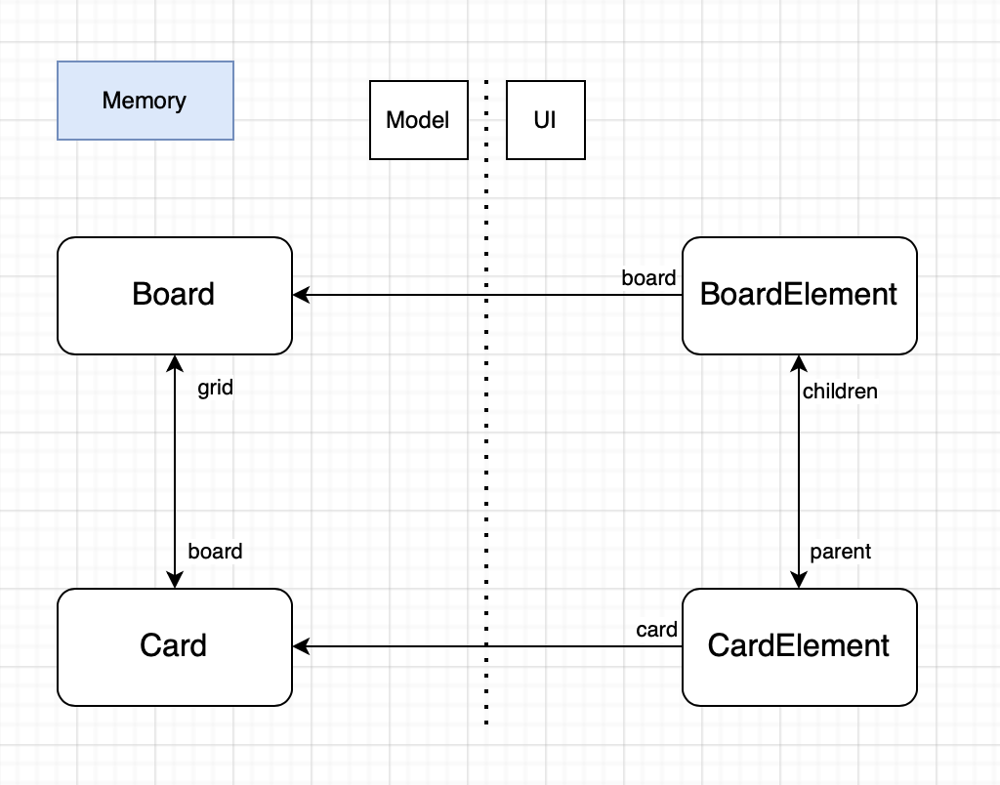
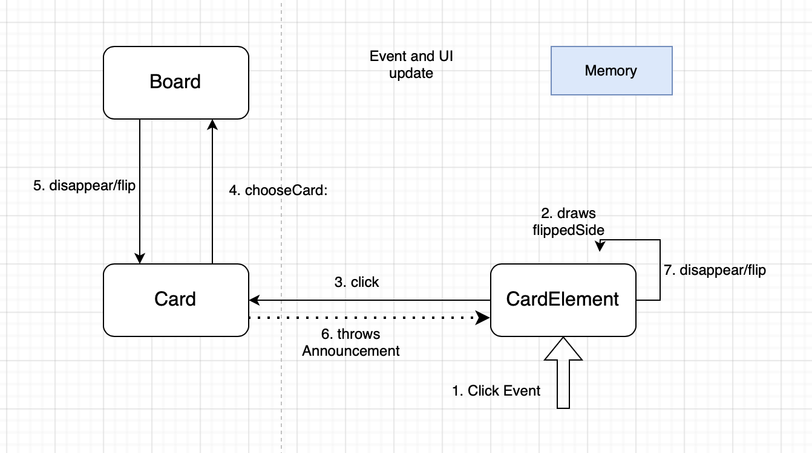

# Memory Documentation

Memory is a game created with Myg, the goal is to find pairs of cards and clear a board.

This document aims to explain the implementation of this project and how was designed the architecture between Model and UI using Bloc.

## Basics

This game was created to serve as a Bloc tutorial, it presents some aspects of building an UI with Bloc such as layouts, events and announcements.

The model for Memory follows the basics of Myg architecture with a `MgdBoard` (inheriting `MygBoard`) containing many `MgdCard` (inheriting `MygAbstractBox`).
  
The UI side of the project also follows the basic Myg architecture but this game is considered "static" as a CardElement represents a Card and will only apply changes to this Card



Each CardElement will have a backSide and a flippedSide that will represent whenever a card is flipped or not. The cards are by default face down which means we draw their backSide by default. When clicking on a card, we draw its flippedSide and wait for another card to be clicked, this will result of either make both cards disappear if they match, or flip both cards back, the CardElements then wait for the model to throw a `MgdCardDisappearAnnouncement` or a `MgdCardFlipBackAnnouncement`

We develop the concept of Announcements in the following chapter

## Annoucements 

Announcements are objects that represent the concept of an object listening to another. An object "Listener" can subsribe to an Announcer that is held by an object "Speaker". During execution, the Speaker can announce some Announcements, making the Listener react depending each Announcement. This is the architecture used here.

We define in our Cards an attribute 'announcer' (here lazily initialized) and we make our CardElement subscribe to the announcer like such:

```st
MgdCardElement >> #initializeAnnouncements

	card announcer
		when: MgdCardDisappearAnnouncement
		send: #disappear
		to: self.
	card announcer
		when: MgdCardFlipBackAnnouncement
		send: #drawBackSide
		to: self
```

It means that whenever the Card announcer throws the MgdCardDisappearAnnouncement, the CardElement will receive the message 'disappear' which holds the graphical behavior of disappearing (obviously).

This MgdCardDisappearAnnouncement is sent from both cards whenever 2 cards match. 

```st
MgdCard >> #disappear

	self notifyDisappear
```
```st
MgdCard >> #notifyDisappear

	self announcer announce: MgdCardDisappearAnnouncement new
```

The same behavior appears for `MgdCardFlipBackAnnouncement`

```st
MgdCard >> #flip

	flipped := flipped not.
	self notifyFlipped
```
```st
MgdCard >> #notifyFlipped

	self announcer announce: MgdCardFlipBackAnnouncement new
```

The main loop of events is very basic for this game. When clicking on a card, the CardElement draws the flippedSide and the board adds the card to a list named chosenCards, and if this list is now filled with matching cards they simply disappear. Otherwise, the model waits for a new card to be choosed to draw the backSide of the two first cards. 



## State of the project 

For now Memory allows playing 4x4 randomly generated grids with numbers written on the cards.

### Ideas to implement

- Have other symbols on cards
- Make different grid sizes
- Skins