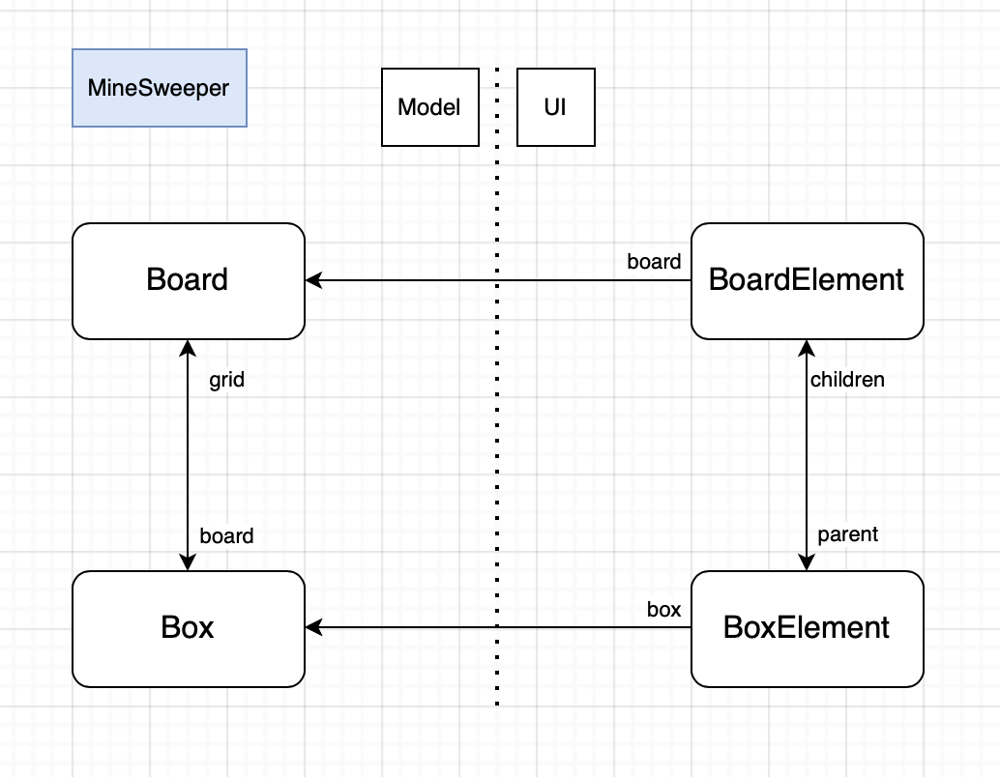
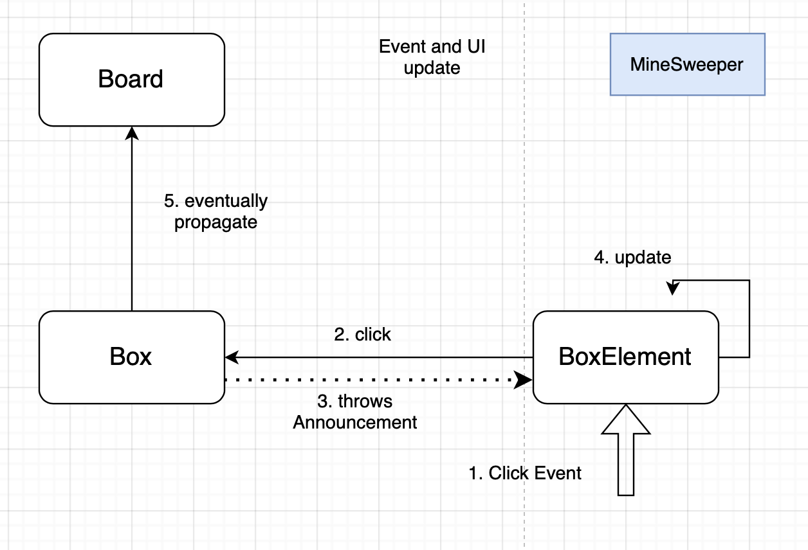

# MineSweeper Documentation

MineSweeper is a game created with Myg, vastely known as one of the favorite games of computer engineers, the goal is the clear a grid without touching any bomb.

This document aims to explain the implementation of this project and how was designed the architecture between Model and UI using Bloc.

## Basics

The model for MineSweer follows the basics of Myg architecture with a MBoard (inheriting MygBoard) containing many MBox (inheriting MygAbstractBox). There are different subclasses to MBox such as the MMine which represent a bomb, and the MSafe which represent a safe cell.
  

The UI side of the project also follows the basic Myg architecture but this game is considered "static" as a BoxElement represents a Box and will only apply changes to this Box but with a little twist.



In fact, when clicking on a safe cell, you uncover its value representing the number of bombs in the neighboring cells and when a cell doesn't have any bomb around, it also unveils the neighboring safe cells. And so clicking on a BoxElement can make other BoxElements react and so the UI needs something more compared to the implementation of Takuzu. The something more we used is called Announcements. 

## Annoucements 

Announcements are objects that represent the concept of an object listening to another. An object "Listener" can subsribe to an Announcer that is held by an object "Speaker". During execution, the Speaker can announce some Announcements, making the Listener react depending each Announcement. This is the architecture used here.

We define in our Boxes an attribute 'announcer' (here lazily initialized) and we make our BoxElement subscribe to the announcer like such:

```st
initializeAnnouncements

	self box announcer
		when: MBoxExplosionAnnouncement
		send: #mine
		to: self.
	self box announcer
		when: MBoxClickedAnnouncement
		send: #click
		to: self
```

It means that whenever the Box announcer throws the MBoxExplosionAnnouncement, the BoxElement will receive the message 'mine' which holds the graphical behavior of clicking on a MMineBox.

This MBoxExplosionAnnouncement is sent from the MMineBox that has just been clicked 

```st
click

	self isFlagged ifTrue: [ ^ self ].
	self announcer announce: MBoxExplosionAnnouncement new.
	self board gameEnded ifFalse: [ self board playerLoose ]
```

This means that when clicking on a BoxElement, it tells its Box the be clicked and then the Box throws an Announcement that is listened by the BoxElement so it updates itself.



## State of the project 

For now MineSweeper allows playing 5x5 grids (Don't get lured by "small" or "very large" buttons they just represent the space size). These grids are ramdomly generated with 1 chance out of 4 for a cell to be a Mine.

### Ideas to implement

- Perfect the random generation (avoid bomb at first click)
- Add a 'Hint' feature
- Make different grid sizes
- Skins