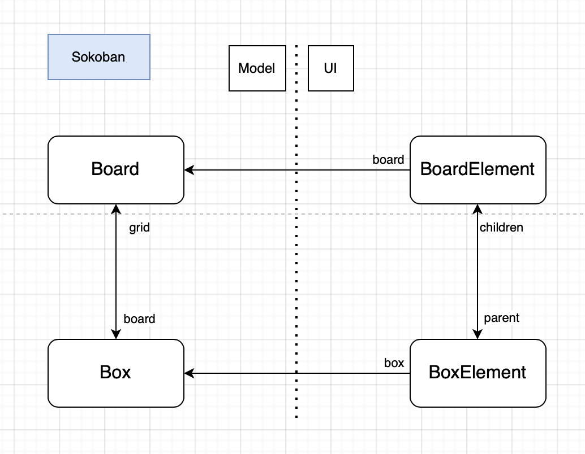

# Sokoban Documentation

Sokoban is a game created with Myg, the goal is to push crates onto targets 

This document aims to explain the implementation of this project and how was designed the architecture between Model and UI using Bloc.

## Basics

The model for Sokoban follows the basics of Myg architecture with a SkBoard (inheriting MygBoard) containing many SkElement (inheriting MygAbstractBox). There are different subclasses to SkElement such as the SkBox which represent a box to be placed, the SkTarget which represent a target on which a box needs to be, and others...
  
The UI side of the project also follows the basic Myg architecture but this game is considered "dynamic" as there are animations giving a dynamic feeling but more importantly BoxElements will dynamicaly change their boxes and update themselves according to the SkBox object and not only a value of this object as it is the case in Takuzu for example.
Also, the nature of this game made us use layers of Elements for the UI but this will be detailed in the next chapter.

This "dynamic" state also requires for a BoardElement to know how to identify its elements to easily interact with them because only a few elements will require a visual update and so we decided to filter those elements and update them instead of drawing again the whole board or update them only when receiving an interaction as no element directly receive any interaction

 * Note : In fact, we could update our elements when receiving an interaction that could be when changing the box class and thus use Announcements like in the MineSweeper but our current implementation highlights another way to update our UI and serves the documentation of Myg.




The approach here could be called "dirty removing" as we cherry pick the elements that will need an update.

## UI with layers

This game has elements that moves (Player, Boxes) and some that don't (Walls, Targets). So we simply decided to have 2 layers as we briefly mentioned, one with "static" elements such as walls and targets that will lie "in the background" and the other layer containing "dynamic" elements on top of it so "in the foreground". You can see the both layers right here for the first level.


* Note : We decided to represent each SkGround transparent and we also filled the foreground layer with SkGround as we benefit from the transparency, but this would be a bad implementation if we decided to give a specific representation to the ground cells. We might just have to create a transparent element or no element at all but we wouldn't benefit from the grid layout used here. Can be improved 

For the event handling, we chose to put it in the BoardElement as the only interactions we have are with arrow keys (and also the spacebar to reset a level), we describe it in the next chapter 

## Events 

As we just explained, our only events come from arrow keys and thus could be considered "global" to the BoardElement even though they only apply to the player but of course might affect multiple elements when the player is moving. 

When receiving an event, the board just prepares the elements to be updated (the player cell ,the next cell with the player on it, and eventually the cell after it if a box moved), this describes the "cerry picking" part. Then it tells the player to move and if it eventually moved, it might need to check if a box moved with it as there would be an animation played on the box. We now have the dirty elements and we can just update them

* As I wrote this, I can tell things can be improved some way, this doesn't feel optimized

```st
manageEvent: anEvent

	| player moved direction neighborElement elements |
	anEvent key name = #SPACE ifTrue: [ ^ self resetBoard ].
	anEvent key name = #ESCAPE ifTrue: [ ^ self space close ].
	board isFinished ifTrue: [ ^ self ].
	player := self board player.
	direction := self directionDict
		             at: anEvent key name
		             ifAbsent: [ ^ self ].
	elements := self
		            elementsToUpdateAtPosition: player position
		            goingIn: direction.
	neighborElement := elements second.

	moved := player move: direction.


	(moved and: [ neighborElement box class = MygSkBox ])
		ifTrue: [
			| animation |
			animation := neighborElement boxAnimationMovingInDirection:
				             direction.
			neighborElement addAnimation: (animation onFinishedDo: [
					 neighborElement resetAnimation.
					 self updateElements: elements ]) ]
		ifFalse: [ self updateElements: elements ]
```

The method `updateElements:` then simply link each Element to its new box and update its background.

```st
updateElements: anOrderedCollection

	anOrderedCollection do: [ :each |
		each boxForForeground updateBackgroundColor ]
```

```st
boxForForeground

	| newBox |
	newBox := self board atPosition: self positionInField.
	self box: ((newBox class inheritsFrom: MygSkMovable)
			 ifFalse: [ MygSkGround new ]
			 ifTrue: [ newBox ])
```

The process behind this can be represented here:


## State of the project 

For now Sokoban allows playing lots of imported levels (These were handcrafted by the community but they were not verified and some might be falsy).

### Ideas to implement

- Add an 'Undo' feature
- Skins
- Level Editor
- Solver for a 'Hint' feature