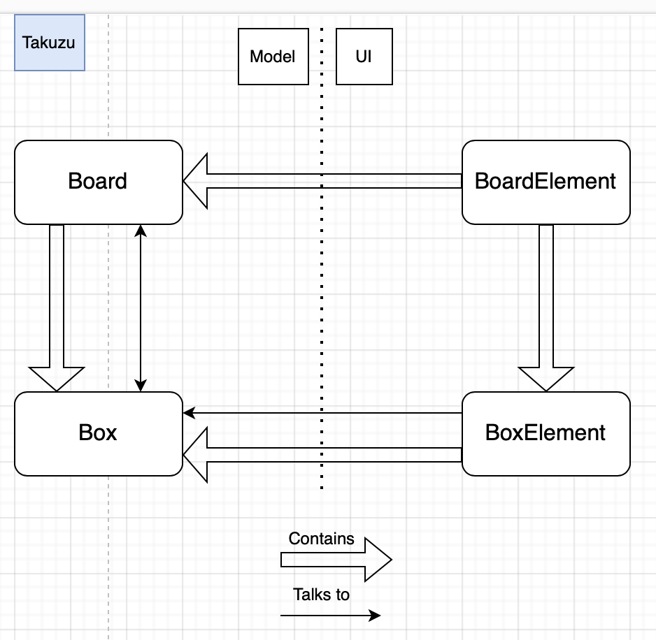
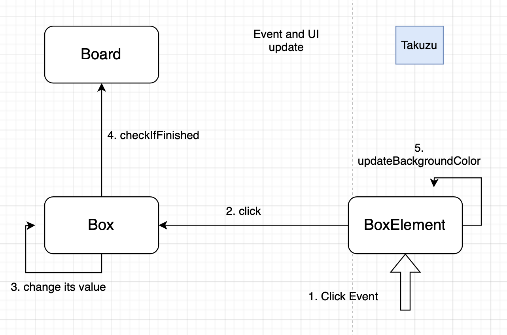

# Takuzu Architecture

Takuzu is a game created with Myg, also known as 'binary-sudoku', you need to complete a grid following a set of rules.
This game is inspired by [http://0hh1.com](http://0hh1.com).


This document highlights some key points of the implementation of this project and how was designed the architecture between the domain model and UI using Bloc.

## Basics

The model for Takuzu follows the basics of Myg architecture with a class `TBoard` (inheriting from `MygBoard`) containing many `TBox` (inheriting from `MygAbstractBox`). There are different subclasses to `TBox` such as `TFixedBox` which represents a Box with an unmodified value, and  `TUnknownBox` whose value can change and is initialized to nil.

- Box values take one values from [0, 1, nil]. 
- There are 2 subclasses of `TFixedBox` named `TFixedBox0` and `TFixedBox1` but these are only used for level importing.
SD: so the model of a box we click on is instance of TFixedBox?


The UI side of the project also follows the basic Myg architecture but this game is considered "static" as a box element will only apply changes to its box and thus will not influence any of the other box element constituting the UI, also no box will change its position in the board and so a box element will stay in the same place representing the same boxe.


There is an exception in the `lockAll` method where it changes all other box element's that represent a `TFixedBox`. A simple `do:` message on the `BoardElement` children will work. 
The method `lockAll` is defined as follows: 
 
```smalltalk
TBoxElement >> lockAll

	self parent children do: [ :each |
		each box isTFixedBox ifTrue: [ each lock ] ]
```

SD Question: why not just send lock and redefine lock on certain classes to do nothing. 




## Event interaction

A good question to ask is "How are the events handled and how is the UI updated?" and this paragraph is here to explain it.

First, let's talk about the events. In Takuzu, the events are simple, there is just a `ClickEvent` (`BlMouseUpEvent` in the current implementation), and when a `BoxElement` receives a `ClickEvent`, it sends the 'click' message to its box which changes its value and asks the board to check if the game is finished. (If we clicked on a `TFixedBox`, only the UI will change with the `lockAll` method presented above).

The UI will be updated in the same method that sent the click message to the box. Here we use the static property of the game that allows us to tell our BoxElement to update itself according to its Box value as the Box remains the same and only values change.

So when a `BoxElement` receives a `ClickEvent`, it receives the `click` message that is defined like this: 

```smalltalk
TBoxElement >> click

	self box isTFixedBox
		ifTrue: [ self lockAll ]
		ifFalse: [
			self box click.
			self updateBackgroundColor ]
```

SD: Why do we need this test and why not having two methods click one 
that lockAll and another doing `self box click. self updateBackgroundColor` 

And the whole process is represented in this diagram *@takuzufig@*.




SD: How the self box click communicates to the UI?

## State of the project 

At the moment of writing this documentation, Takuzu contains 5 levels for each 5 grid sizes that were hand-picked from [0hh1](0hh1.com).

You can also launch random-generated 4x4 and 6x6 grids as the current implementation doesn't work for bigger grid sizes. 
Note that the current implementation for random grids allows ambiguous levels where more than 1 solution might be possible and this may lead the player in a case where there is no more 'logical way' to find a Box except trying a value. 


### Ideas to implement
Here are a couple of possible improvements
- Count the number of click to reach a solution.
- Perfect the random generation (with human-like strategies)
- Add a 'Hint' feature.
- Define or import more levels
