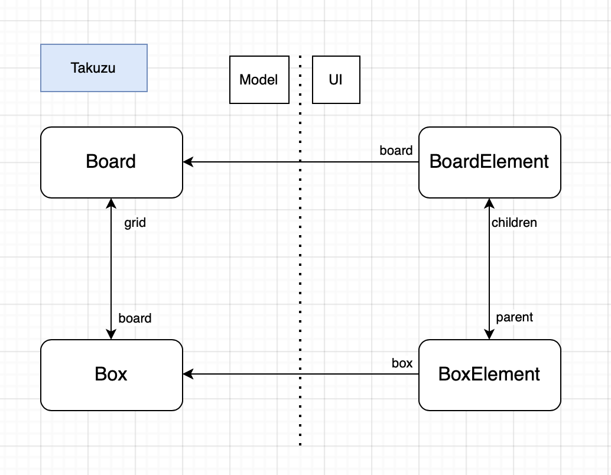

# Takuzu Documentation

Takuzu is a game created with Myg, also known as 'binary-sudoku', you need to complete a grid following a set of rules.

This game is greatly inspired by [0hh1](0hh1.com)

This document aims to explain the implementation of this project and how was designed the architecture between Model and UI using Bloc.

## Basics

The model for Takuzu follows the basics of Myg architecture with a TBoard (inheriting MygBoard) containing many TBox (inheriting MygAbstractBox). There are different subclasses to TBox such as the TFixedBox which represent a Box with an unmodified value, and the TUnknownBox which value can change and is initialized to nil.

* Note : The values of Boxes takes one from [0,1,nil], maybe we should have a different value for 'nil' 
  
* Note: There are 2 subclasses of TFixedBox named 'TFixedBox0' and 'TFixedBox1' but these are only used for level importing

The UI side of the project also follows the basic Myg architecture but this game is considered "static" as a BoxElement will only apply changes to its Box and thus will not influence any of the other BoxElement constituing the UI, also no Box will change its position in the Board and so BoxElements will stay in the right place representing the same Boxes.

There is an exception in the 'lockAll' method where it changes all other BoxElements that represent a TFixedBox so a simple do: message on the BoardElement children will work. The method 'lockAll' is written as such : 
```smalltalk
lockAll

	self parent children do: [ :each |
		each box isTFixedBox ifTrue: [ each lock ] ]
```


## Event interaction

The right question to ask is "How are the events handled and how is the UI updated ?" and this paragraph is here to explain it all.

First, let's talk about the events. In Takuzu the events are simple, there is just a ClickEvent, and when a BoxElement receive a ClickEvent, it sends the 'click' message to its box which changes its value and ask the board the check if the game is finished. (If we clicked on a TFixedBox, only the UI will change with the lockAll method presented above).

The UI will be updated in the same method that sent the click message to the box. Here we use the static property of the game that allows us to tell our BoxElement to update itself according to its Box value as the Box remains the same and only values change.

So when a BoxElement receive a ClickEvent, it receives the 'click' message that is defined like this: 
```smalltalk
click

	self box isTFixedBox
		ifTrue: [ self lockAll ]
		ifFalse: [
			self box click.
			self updateBackgroundColor ]
```

And the whole process is represented in this diagram


## State of the project 

For now Takuzu contains 5 levels for each 5 grid sizes that were hand-picked from [0hh1](0hh1.com).

You can also launch random-generated 4x4 and 6x6 grids as the current implementation doesn't work for bigger grid sizes. 
Note that the current implementation for random grids allows ambiguous levels where more than 1 solution might be possible and this may lead the player in a case where there is no more 'logical way' to find a Box except trying a value. 


### Ideas to implement

- Perfect the random generation (with human-like strategies)
- Add a 'Hint' feature
- Maybe import more levels
- Skins